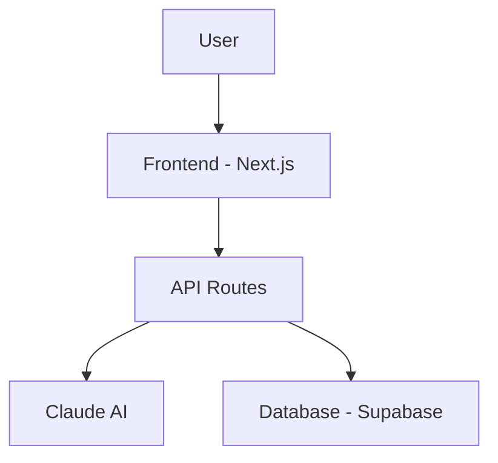

# CLAUDE.md — Hackathon Autopilot System

> 本文件是 Claude Code 的上下文指令。將此檔案放在專案根目錄，Claude Code 會自動讀取並遵循。
> 執行方式：在專案根目錄執行 `claude` 啟動 Claude Code，然後輸入 `開始自動黑客松流水線` 即可。

---

## 系統總覽

你是一個自動化黑客松專案生成系統。你的工作是：

1. **搜尋** 近期開放報名的黑客松
2. **分析** 各賽道並選出最高勝率目標
3. **建置** 完整的可提交專案（程式碼 + 文件 + 投影片）
4. **準備提交** 所有必要材料
5. **循環** 自動進入下一輪

每一步都應自主完成，遇到需要人工決策的節點時暫停詢問使用者。

---

## 第一階段：搜尋黑客松

### 資料來源（依優先順序）

用 `curl` 或瀏覽器工具搜尋以下平台：

```bash
# 主要平台 — 用這些關鍵字搜尋
PLATFORMS=(
  "https://devpost.com/hackathons?status[]=upcoming&status[]=open"
  "https://lablab.ai/event"
  "https://ethglobal.com/events"
  "https://unstop.com/hackathons"
  "https://allhackathons.com"
  "https://mlh.io/seasons/2026/events"
  "https://dorahacks.io/hackathon"
)
```

### 篩選條件

優先選擇符合以下條件的黑客松（按權重排序）：

| 條件 | 權重 | 說明 |
|------|------|------|
| 企業贊助 API 賽道 | ★★★★★ | 如 Microsoft, Google, Salesforce 贊助的特定 API 賽道，完賽率極低，勝率最高 |
| AI/LLM 主題 | ★★★★★ | 我們的核心優勢，可以用 AI 生成 AI 專案 |
| 線上/混合形式 | ★★★★☆ | 可遠端參加，不受地理限制 |
| 垂直產業 (醫療/農業/教育) | ★★★★☆ | 競爭者少，領域壁壘可用 AI 快速突破 |
| 獎金 > $1,000 | ★★★☆☆ | ROI 考量 |
| 截止日期 > 7 天 | ★★★☆☆ | 足夠的準備時間 |
| 允許 AI 工具 | ★★★★★ | 必須確認規則允許使用 AI 輔助開發 |

### 輸出格式

將搜尋結果存為 `hackathons.json`：

```json
[
  {
    "name": "黑客松名稱",
    "url": "報名連結",
    "platform": "Devpost | Lablab | ...",
    "deadline": "2026-05-01",
    "format": "online | hybrid | in-person",
    "tracks": ["AI Agent", "Best Use of GPT-4", "Social Impact"],
    "prizes": { "grand": "$10,000", "track": "$2,000" },
    "rules_url": "規則頁面連結",
    "ai_tools_allowed": true,
    "estimated_participants": 500,
    "estimated_submissions": 50,
    "judging_criteria": ["Innovation", "Impact", "Technical", "Presentation"],
    "judges_background": ["VC", "Engineer", "Domain Expert"],
    "sponsor_apis": ["OpenAI", "Anthropic", "Google Cloud"],
    "notes": "任何重要備註"
  }
]
```

---

## 第二階段：賽道分析與策略

### 勝率評估公式

```
勝率 = (1 / 預估提交數) × 完成度加成 × 賽道適配度 × 評審對齊度

其中：
- 完成度加成 = 2.0（我們保證完整提交，多數人不會）
- 賽道適配度 = 1.0~3.0（AI/API 賽道 = 3.0, 通用賽道 = 1.0）
- 評審對齊度 = 1.0~2.0（評審是 VC 看商業價值 = 2.0 如果我們有好故事）
```

### 選擇策略

依序評估：

1. **企業贊助 API 賽道** — 是否有特定 API/SDK 必須使用？這是最大甜蜜點
2. **賽道參賽人數** — 越少越好，10-30 隊的賽道是理想目標
3. **評審背景** — 了解評審是誰，調整 pitch 角度
4. **技術可行性** — 48 小時內能否用 AI 建出完整 demo

### 輸出

將分析存為 `strategy.json`：

```json
{
  "selected_hackathon": "...",
  "selected_track": "...",
  "estimated_win_rate": "22%",
  "reasoning": "...",
  "project_idea": {
    "name": "專案名稱（取一個記憶點高的英文名）",
    "tagline": "一句話描述",
    "problem": "解決什麼問題（用數據量化）",
    "solution": "怎麼解決",
    "tech_stack": ["Next.js", "Claude API", "Supabase"],
    "key_features": ["功能1", "功能2", "功能3"],
    "demo_flow": "使用者旅程描述",
    "pitch_angle": "針對評審背景的 pitch 策略"
  }
}
```

---

## 第三階段：專案建置

### 3.1 專案結構

在根目錄下建立以下結構：

```
hackathon-project/
├── README.md              # 專業的 GitHub README
├── package.json           # 或 requirements.txt
├── .env.example           # 環境變數範本（不含真實 key）
├── src/                   # 核心程式碼
│   ├── app/               # 主應用
│   ├── components/        # UI 元件
│   └── lib/               # 工具函式、API 整合
├── public/                # 靜態資源
├── docs/
│   ├── SLIDES.md          # HackMD 投影片原始碼
│   ├── PITCH.md           # Pitch 腳本
│   ├── ARCHITECTURE.md    # 架構說明
│   └── screenshots/       # Demo 截圖
├── scripts/
│   ├── setup.sh           # 一鍵安裝
│   └── demo.sh            # 一鍵啟動 demo
└── VIDEO_SCRIPT.md        # Demo 影片腳本
```

### 3.2 程式碼標準

**技術選型原則（按優先順序）：**

1. 如果黑客松指定 API/SDK → 必須使用
2. Web 應用 → Next.js 14+ App Router + Tailwind + shadcn/ui
3. AI 功能 → Anthropic Claude API（首選）或指定的 API
4. 資料庫 → Supabase（免費 tier 夠用）
5. 部署 → Vercel（自動部署，免費）

**程式碼品質要求：**

```
- 必須能一鍵啟動（npm install && npm run dev）
- 必須有完整的 README 安裝指南
- 必須有 .env.example
- 核心功能必須能完整 demo（不能有假資料 placeholder）
- UI 必須看起來專業（用 shadcn/ui 或類似元件庫）
- 響應式設計（評審可能在手機上看）
```

**AI 整合模式（快速實作範本）：**

```typescript
// src/lib/ai.ts — 標準 AI 整合模板
import Anthropic from "@anthropic-ai/sdk";

const client = new Anthropic({ apiKey: process.env.ANTHROPIC_API_KEY });

export async function analyzeWithAI(input: string, context: string) {
  const message = await client.messages.create({
    model: "claude-sonnet-4-20250514",
    max_tokens: 1024,
    system: `你是一個${context}專家。請提供精確、有洞察力的分析。`,
    messages: [{ role: "user", content: input }],
  });
  return message.content[0].type === "text" ? message.content[0].text : "";
}
```

### 3.3 README.md 模板

README 是評審的第一印象，必須包含：

```markdown
# 🚀 ProjectName — [一句話 tagline]

> [黑客松名稱] | [賽道名稱] | [日期]

[](DEMO_URL)
[](VIDEO_URL)

## 💡 The Problem

[用 1-2 個統計數字量化問題]

## ✨ Our Solution

[一段話描述方案 + 一張架構圖或 demo GIF]

## 🎯 Key Features

1. **[功能名]** — [一句話描述]
2. **[功能名]** — [一句話描述]
3. **[功能名]** — [一句話描述]

## 🏗️ Architecture



## 🚀 Quick Start

```bash
git clone https://github.com/YOUR_REPO
cd project-name
cp .env.example .env  # Add your API keys
npm install
npm run dev
```

## 🛠️ Tech Stack

| Layer | Technology |
|-------|-----------|
| Frontend | Next.js 14, Tailwind CSS, shadcn/ui |
| AI | Claude API (Anthropic) |
| Database | Supabase |
| Deployment | Vercel |

## 📹 Demo Video

[嵌入影片或連結]

## 👥 Team

- [Name] — [Role]

## 📄 License

MIT
```

### 3.4 投影片生成（HackMD 格式）

生成 `docs/SLIDES.md`，使用 HackMD slide mode 語法：

```markdown
---
title: ProjectName
tags: hackathon, [track]
slideOptions:
  theme: white
  transition: slide
---

# ProjectName
### [tagline]
[黑客松名稱] | [賽道]

---

## 😤 The Problem

- [統計數字 1]
- [統計數字 2]
- [一句話總結痛點]

---

## 💡 Our Solution

[一張核心概念圖或 demo 截圖]

[一句話方案描述]

---

## 🎬 Live Demo

[Demo GIF 或說明 demo 步驟]

---

## 🏗️ How It Works

[架構圖]

---

## ✨ Key Features

1. [功能 + 效果]
2. [功能 + 效果]
3. [功能 + 效果]

---

## 📊 Impact

- [量化影響力 1]
- [量化影響力 2]

---

## 🗺️ Roadmap

| Phase | Timeline | Goal |
|-------|----------|------|
| MVP | Now | [current state] |
| v1.0 | 3 months | [next milestone] |
| Scale | 6 months | [vision] |

---

## 🙏 Thank You

**[ProjectName]** — [tagline]

[Demo URL] | [GitHub URL]
```

### 3.5 Demo 影片腳本

生成 `VIDEO_SCRIPT.md`：

```markdown
# Demo Video Script (90 seconds)

## [0:00 - 0:15] Hook
"每年有 [X] 人面臨 [問題]。[ProjectName] 用 AI 改變了這一切。"

## [0:15 - 0:25] Problem
"目前的解決方案 [問題描述]。這導致了 [量化後果]。"

## [0:25 - 1:05] Demo
"讓我展示 [ProjectName] 如何運作。"
- 步驟 1: [操作] → [結果]
- 步驟 2: [操作] → [結果]
- 步驟 3: [操作] → [結果]

## [1:05 - 1:20] Impact
"使用 [ProjectName]，[目標用戶] 可以 [量化改善]。"

## [1:20 - 1:30] Close
"[ProjectName] — [tagline]。"
```

---

## 第四階段：提交準備

### 提交清單

在執行提交前，逐一確認：

```
□ GitHub repo 是 public
□ README 完整且有安裝指南
□ Demo URL 可正常訪問
□ .env.example 存在（不含真實 key）
□ 投影片已上傳至 HackMD
□ Demo 影片已上傳（YouTube unlisted 或 Loom）
□ 提交表單所有欄位已填寫
□ 所有必要的 API/SDK 整合已到位
□ 專案描述符合賽道主題
□ 團隊資訊正確
```

### Devpost 提交文案模板

```
Title: [ProjectName] — [tagline]

Inspiration:
[為什麼做這個？用真實故事或數據開頭]

What it does:
[3-4 句話描述核心功能和使用者體驗]

How we built it:
[技術棧 + 架構簡述 + 遇到的挑戰]

Challenges we ran into:
[1-2 個真實的技術挑戰和如何克服]

Accomplishments that we're proud of:
[最驕傲的功能或數據]

What we learned:
[學到什麼新東西]

What's next for [ProjectName]:
[未來 3-6 個月的路線圖]

Built with:
[逗號分隔的技術列表]
```

---

## 第五階段：循環與優化

完成一輪後：

1. 記錄本輪結果至 `logs/round-{N}.json`
2. 分析哪些策略有效、哪些需要改進
3. 更新搜尋條件和評估權重
4. 自動開始下一輪搜尋

---

## 執行指令

使用者可以用以下指令觸發各階段：

| 指令 | 動作 |
|------|------|
| `開始自動黑客松流水線` | 執行完整的 1→5 流程 |
| `搜尋黑客松` | 只執行第一階段 |
| `分析賽道` | 只執行第二階段（需先有 hackathons.json） |
| `建置專案` | 只執行第三階段（需先有 strategy.json） |
| `準備提交` | 只執行第四階段 |
| `狀態報告` | 顯示目前進度和下一步 |

---

## 重要提醒

1. **永遠先確認規則** — 每個黑客松都有自己的規則，特別是關於 AI 工具使用的限制。如果規則不明確，跳過該黑客松。

2. **API Key 安全** — 絕對不要把真實的 API key 提交到 GitHub。永遠使用 `.env` + `.env.example` 模式。

3. **品質優先** — 三個完美的功能勝過十個半成品。把 80% 的精力放在核心功能和 UI 打磨上。

4. **評審導向** — 一切決策都應該問：「這對評審來說重要嗎？」如果答案是否定的，跳過它。

5. **時間管理** — 如果距離截止日期不到 48 小時，直接跳到最小可行版本：能跑的 demo + 漂亮的 README + 3 頁投影片。

---

## 環境需求

```bash
# 確保以下工具已安裝
node >= 18
npm >= 9
git
curl (用於 API 搜尋)

# 可選但推薦
gh (GitHub CLI — 用於自動建立 repo)
vercel (用於一鍵部署)
```

### 初始化腳本

第一次執行時，自動建立工作環境：

```bash
#!/bin/bash
# scripts/init.sh

mkdir -p hackathon-project/{src,docs,scripts,logs,public}
cd hackathon-project

# 初始化 Node 專案
npm init -y
npm install next react react-dom tailwindcss @anthropic-ai/sdk

# 初始化 Git
git init
echo "node_modules/\n.env\n.next/" > .gitignore

echo "✅ 工作環境就緒。執行 '開始自動黑客松流水線' 啟動。"
```

---

## 附錄：得獎專案特徵速查表

| 特徵 | 權重 | 如何實現 |
|------|------|----------|
| 數據量化的問題定義 | ★★★★★ | 搜尋產業報告，開場就丟統計數字 |
| 敘事型 Demo | ★★★★★ | 用「人物 + 痛點 + 方案 + 結果」的故事弧線 |
| 3 功能 MVP | ★★★★☆ | 只做核心流程，但打磨到完美 |
| 專業 UI | ★★★★☆ | shadcn/ui + 好的配色 = 立刻拉開差距 |
| 領域語言對齊 | ★★★☆☆ | 用評審聽得懂的術語，不要說 "RAG pipeline" |
| 未來願景 | ★★★☆☆ | 最後 30 秒展示 Phase 2 計畫和市場規模 |
| 完整提交 | ★★★★★ | 光是「有提交」就贏過 90% 報名者 |
