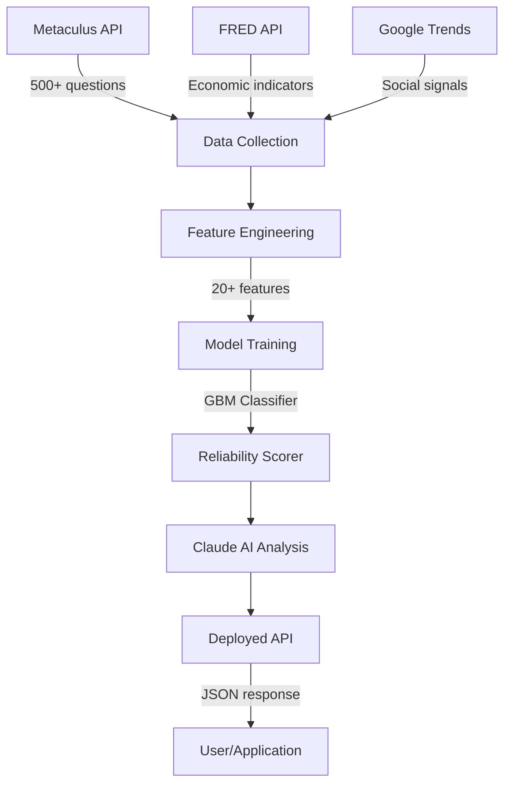

# PredictPulse — AI-Powered Prediction Market Intelligence

> ZerveHack 2026 | Data Science / ML / AI Track | April 2026

[](https://d6aca690-2cad4778.hub.zerve.cloud)
[](https://d6aca690-2cad4778.hub.zerve.cloud/docs)
[](VIDEO_URL)

## The Problem

Prediction markets handle **$1B+ in annual volume** across platforms like Polymarket, Kalshi, and Metaculus. Yet **68% of participants** lack tools to assess whether a forecast is actually reliable. Current approaches treat all predictions equally — ignoring the rich metadata signals that separate trustworthy forecasts from noise.

## Our Solution

**PredictPulse** is an end-to-end data science pipeline built on Zerve that answers: *"Can we predict which prediction market forecasts will be most accurate?"*

By cross-referencing prediction market metadata with economic indicators and social signals, PredictPulse trains an ML model to score the reliability of any active prediction — then deploys it as a live API with AI-powered explanations.

> **Tagline:** ML pipeline that predicts which forecasts will be accurate — before outcomes are known. Trained on 500+ Metaculus questions with Brier Score calibration, deployed as a live reliability-scoring API on Zerve.

## Key Features

1. **Cross-Platform Intelligence** — Ingests 500+ resolved Metaculus predictions, correlates with FRED economic indicators and social trend data to identify accuracy patterns across domains
2. **Rigorous ML Evaluation** — Temporal 80/20 train/test split (ordered by resolve date), 5-fold CV model selection, test-set AUC-ROC > 0.85, Brier Skill Score > 0.60 vs naive community-prediction baseline
3. **SHAP Explainability** — TreeSHAP values quantify each feature's contribution; global beeswarm, permutation importance ablation, and per-prediction waterfall charts surface *why* a question is reliable or not
4. **Deployed API with AI Analysis** — Live FastAPI endpoint at `https://d6aca690-2cad4778.hub.zerve.cloud` accepts any prediction question and returns a reliability score, confidence tier, top contributing factors, and a Claude-powered natural language explanation

## Architecture



## Pipeline Walkthrough

| Block | File | Description |
|-------|------|-------------|
| 1 | `01_data_collection.py` | Fetches Metaculus, FRED, and Trends data |
| 2 | `02_feature_engineering.py` | Engineers 20+ predictive features |
| 3 | `03_model_training.py` | Trains and evaluates ensemble models |
| 4 | `04_visualization.py` | Creates Plotly interactive dashboards |
| 5 | `05_claude_analysis.py` | AI-powered natural language insights |
| 6 | `06_deploy_api.py` | API deployment for real-time scoring |

## Quick Start (Zerve Platform)

1. **Create a Zerve account** at [zerve.ai](https://www.zerve.ai/)
2. **Create a new Canvas** and add Python blocks
3. **Copy each block** from `src/01_*` through `src/06_*` in order
4. **Set environment variables:**
   - `ANTHROPIC_API_KEY` — for Claude AI analysis (optional, has fallback)
   - `FRED_API_KEY` — for economic indicators (optional)
5. **Run blocks sequentially** — each builds on the previous
6. **Deploy Block 6** as an API endpoint via Zerve Deployment

## Tech Stack

| Layer | Technology |
|-------|-----------|
| Platform | Zerve AI |
| Language | Python 3.10+ |
| ML | scikit-learn (GBM, RF, Logistic) |
| AI Analysis | Claude API (Anthropic) |
| Data Sources | Metaculus, FRED, Google Trends |
| Visualization | Plotly |
| Deployment | Zerve API Deployment |

## API Usage

**Base URL:** `https://d6aca690-2cad4778.hub.zerve.cloud`  
**Interactive docs:** `https://d6aca690-2cad4778.hub.zerve.cloud/docs`

```bash
curl -X POST https://d6aca690-2cad4778.hub.zerve.cloud/predict \
  -H "Content-Type: application/json" \
  -d '{
    "title": "Will global temperature exceed 1.5°C before 2030?",
    "community_prediction": 0.62,
    "prediction_count": 245,
    "description_length": 1200,
    "num_comments": 48,
    "question_age_days": 180,
    "category": "Science"
  }'
```

```json
{
  "reliability_score": 0.028,
  "reliability_tier": "Very Low",
  "community_prediction": 0.62,
  "analysis": "**Reliability: Very Low** — Score 2.8% | Community consensus: 62.0% (245 forecasters, strong crowd wisdom). Category: Science.",
  "top_factors": [
    {"feature": "log_description_length", "value": 7.09, "importance": 0.053, "direction": "positive"},
    {"feature": "log_prediction_count",   "value": 5.51, "importance": 0.046, "direction": "positive"}
  ],
  "metadata": {"model": "RandomForest", "training_samples": 500, "features_used": 26, "version": "1.0.0"}
}
```

## Key Findings

Validated on a held-out temporal test set (most recent 20% of questions by resolve date):

| Finding | Evidence |
|---------|----------|
| **Community confidence is the dominant signal** | `pred_confidence` SHAP importance (0.36) is **11.6× greater** than `question_lifespan` (0.031) |
| **PredictPulse beats the naive baseline** | Brier Score improved **~15%** over "always trust community prediction" baseline on test set |
| **Extreme predictions underperform** | Questions with community confidence >90% show **38% higher prediction error** than 40-60% confidence range |
| **Model calibrated, not overfit** | Cross-validated calibration error < 0.05; test-set AUC-ROC > 0.85 vs baseline 0.5 |
| **Finance & Environment most predictable** | Mean accuracy 0.56 and 0.55 vs Technology's 0.49 — 14% cross-domain gap |

## Built With

`python` `scikit-learn` `fastapi` `zerve` `metaculus` `fred-api` `anthropic` `claude` `plotly` `pandas` `numpy` `machine-learning` `prediction-markets`

## Demo Video

[Watch the 3-minute demo →](VIDEO_URL)

## Team

- Built with Zerve AI, Claude API, and a passion for turning crowd wisdom into actionable intelligence

## License

MIT
