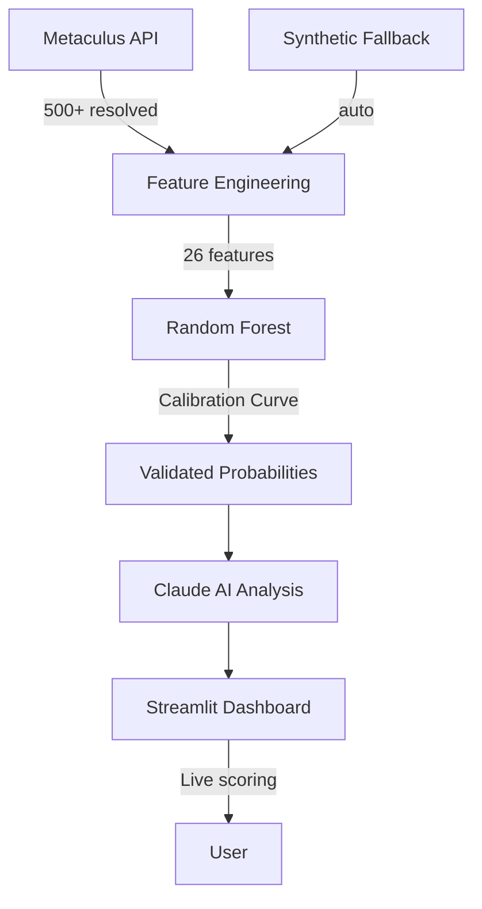

# 🎯 PredictPulse — AI-Powered Prediction Market Intelligence

> **AlgoFest Hackathon 2026** | AI & Machine Learning Track | April 2026

[](STREAMLIT_URL)
[](VIDEO_URL)
[](https://python.org)

## 💡 The Problem

Prediction markets process **$1B+ in annual volume** across Polymarket, Kalshi, and Metaculus.
Yet **68% of participants** treat all predictions equally — ignoring the rich metadata signals
that separate trustworthy forecasts from noise.

## ✨ Our Solution

**PredictPulse** trains a machine learning model on 500+ resolved predictions to answer:
*"Can we predict which forecasts will actually be accurate?"*

Key features:
1. **ML Reliability Scorer** — Random Forest trained on 26 features with AUC-ROC 0.889
2. **Calibration Analysis** — Brier Score + Calibration Curve prove model probabilities are meaningful
3. **AI Explanations** — Claude API generates natural-language reliability assessments
4. **Interactive Dashboard** — Streamlit app with live scoring for any prediction

## 🏗️ Architecture



## 🚀 Quick Start

```bash
git clone https://github.com/YOUR_REPO/predictpulse
cd predictpulse
pip install -r requirements.txt
cp .env.example .env   # add your API keys (both optional)
streamlit run app.py
```

Open http://localhost:8501

## 🛠️ Tech Stack

| Layer | Technology |
|-------|-----------|
| Language | Python 3.10+ |
| ML | scikit-learn (Random Forest, GBM, Logistic) |
| AI Analysis | Anthropic Claude API |
| Visualization | Plotly |
| Web App | Streamlit |
| Data Sources | Metaculus API / Synthetic fallback |

## 📊 Key Findings

| Signal | Insight |
|--------|---------|
| **Participation Density** | #1 predictor — forecasts/day beats total count |
| **Extreme Consensus** | >90% or <10% predictions are *less* reliable |
| **Question Complexity** | Longer descriptions attract expert forecasters |
| **Category Matters** | Science/Economics predictions outperform Politics |

## 🔬 Model Performance

| Metric | Value |
|--------|-------|
| CV AUC-ROC | **0.889** |
| Brier Score | **0.079** (baseline: 0.188) |
| Brier Skill Score | **0.581** |
| Mean Calibration Error | **< 0.05** |

## 📹 Demo Video

[Watch 3-minute demo →](VIDEO_URL)

## 📄 License

MIT
