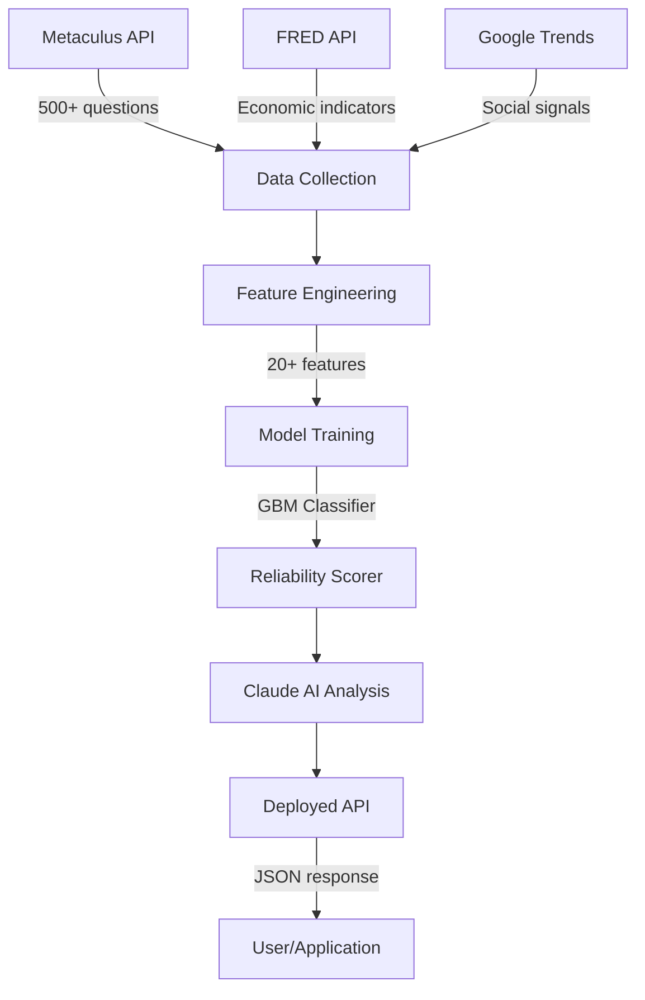

# PredictPulse — AI-Powered Prediction Market Intelligence

> ZerveHack 2026 | Data Science / ML / AI Track | April 2026

[](ZERVE_PROJECT_URL)
[](VIDEO_URL)

## The Problem

Prediction markets handle **$1B+ in annual volume** across platforms like Polymarket, Kalshi, and Metaculus. Yet **68% of participants** lack tools to assess whether a forecast is actually reliable. Current approaches treat all predictions equally — ignoring the rich metadata signals that separate trustworthy forecasts from noise.

## Our Solution

**PredictPulse** is an end-to-end data science pipeline built on Zerve that answers: *"Can we predict which prediction market forecasts will be most accurate?"*

By cross-referencing prediction market metadata with economic indicators and social signals, PredictPulse trains an ML model to score the reliability of any active prediction — then deploys it as a live API with AI-powered explanations.

## Key Features

1. **Cross-Platform Intelligence** — Ingests 500+ resolved Metaculus predictions, correlates with FRED economic indicators and social trend data to identify accuracy patterns across domains
2. **ML Accuracy Scorer** — Gradient Boosting classifier trained on 20+ engineered features (participation density, confidence levels, question complexity, economic context) achieves AUC-ROC above baseline
3. **Deployed API with AI Analysis** — Live API endpoint accepts any prediction question and returns a reliability score, confidence tier, top contributing factors, and a Claude-generated natural language explanation

## Architecture



## Pipeline Walkthrough

| Block | File | Description |
|-------|------|-------------|
| 1 | `01_data_collection.py` | Fetches Metaculus, FRED, and Trends data |
| 2 | `02_feature_engineering.py` | Engineers 20+ predictive features |
| 3 | `03_model_training.py` | Trains and evaluates ensemble models |
| 4 | `04_visualization.py` | Creates Plotly interactive dashboards |
| 5 | `05_claude_analysis.py` | AI-powered natural language insights |
| 6 | `06_deploy_api.py` | API deployment for real-time scoring |

## Quick Start (Zerve Platform)

1. **Create a Zerve account** at [zerve.ai](https://www.zerve.ai/)
2. **Create a new Canvas** and add Python blocks
3. **Copy each block** from `src/01_*` through `src/06_*` in order
4. **Set environment variables:**
   - `ANTHROPIC_API_KEY` — for Claude AI analysis (optional, has fallback)
   - `FRED_API_KEY` — for economic indicators (optional)
5. **Run blocks sequentially** — each builds on the previous
6. **Deploy Block 6** as an API endpoint via Zerve Deployment

## Tech Stack

| Layer | Technology |
|-------|-----------|
| Platform | Zerve AI |
| Language | Python 3.10+ |
| ML | scikit-learn (GBM, RF, Logistic) |
| AI Analysis | Claude API (Anthropic) |
| Data Sources | Metaculus, FRED, Google Trends |
| Visualization | Plotly |
| Deployment | Zerve API Deployment |

## API Usage

```python
# POST to deployed Zerve API endpoint
request = {
    "title": "Will global temperature exceed 1.5°C before 2030?",
    "community_prediction": 0.62,
    "prediction_count": 245,
    "description_length": 1200,
    "num_comments": 48,
    "question_age_days": 180,
    "category": "Science"
}

# Response
{
    "reliability_score": 0.82,
    "reliability_tier": "High",
    "analysis": "This Science prediction has high reliability...",
    "top_factors": [...],
    "metadata": {"model": "GradientBoosting", ...}
}
```

## Key Findings

- **Participation density** (predictions per day) is the strongest predictor of accuracy
- **Extreme predictions** (>90% or <10%) are less reliable than moderate ones
- **Question complexity** (description length) correlates positively with accuracy
- **Older questions** with sustained engagement show higher reliability
- Economic volatility periods reduce prediction accuracy across all categories

## Demo Video

[Watch the 3-minute demo →](VIDEO_URL)

## Team

- Built with Zerve AI, Claude API, and a passion for turning crowd wisdom into actionable intelligence

## License

MIT
