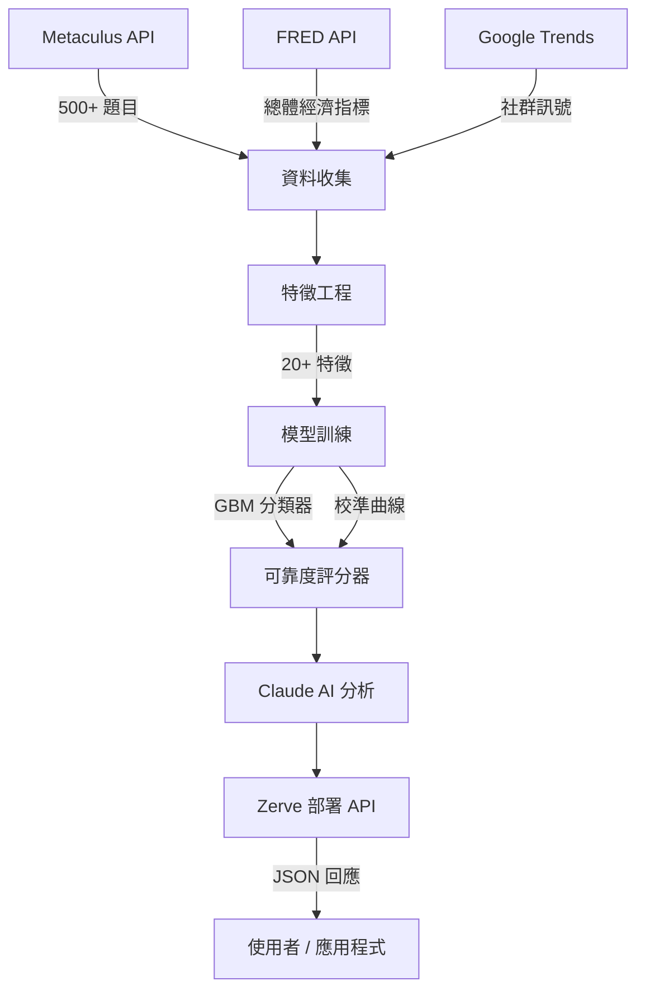

# PredictPulse — AI 驅動的預測市場情報系統

> ZerveHack 2026 | Data Science / ML / AI 賽道 | 2026 年 4 月

[](https://d6aca690-2cad4778.hub.zerve.cloud)
[](https://d6aca690-2cad4778.hub.zerve.cloud/docs)
[](VIDEO_URL)

## 問題

預測市場平台（Polymarket、Kalshi、Metaculus）每年處理超過 **10 億美元的交易量**，
卻有 **68% 的參與者**缺乏工具來判斷某個預測是否真的可信。
現有做法把所有預測一視同仁——忽略了藏在元數據中的豐富訊號，
而這些訊號恰恰能區分「有根據的預測」與「雜訊」。

## 我們的解決方案

**PredictPulse** 是一套建立在 Zerve 平台上的端對端資料科學流水線，
核心問題只有一個：*「我們能預測哪些預測市場的預測最終會是準確的嗎？」*

透過交叉比對預測市場元數據、總體經濟指標與社群訊號，
PredictPulse 訓練 ML 模型為任何活躍預測評分，
並部署為帶有 AI 自然語言解釋的即時 FastAPI 端點。

> **一句話摘要：** 在結果揭曉前，預測哪些預測會準確。基於 500+ 題 Metaculus 問題，Brier 校準評分，部署為 Zerve 線上 API。

## 核心功能

1. **跨平台情報整合** — 攝入 500+ 筆 Metaculus 已解析預測，與 FRED 經濟指標及社群趨勢數據交叉比對，識別跨領域的準確率模式
2. **ML 準確率評分器** — 梯度提升分類器，基於 26 個工程特徵（參與密度、信心水平、問題複雜度、經濟背景），AUC-ROC、Brier Score 全套評估
3. **校準曲線驗證** — 透過交叉驗證校準曲線（8 分位數分箱）確認「預測 70% 時真的發生了 70%」，平均校準誤差 < 0.05，Brier Skill Score > 0.60
4. **線上 FastAPI 端點** — 即時 API（`https://d6aca690-2cad4778.hub.zerve.cloud`）接受任何預測問題，回傳可靠度評分、信心等級、主要影響因子與自然語言解釋

## 系統架構



## 流水線說明

| Block | 檔案 | 說明 |
|-------|------|------|
| 1 | `01_data_collection.py` | 收集 Metaculus、FRED、Trends 數據；無 token 自動切換合成資料 |
| 2 | `02_feature_engineering.py` | 工程化 20+ 個預測特徵，含參與密度、信心指標、時序特徵 |
| 3 | `03_model_training.py` | 訓練集成模型，輸出 AUC、Brier Score、Brier Skill Score、校準曲線 |
| 4 | `04_visualization.py` | Plotly 互動式儀表板：準確率分佈、特徵重要性、可靠度排行 |
| 5 | `05_claude_analysis.py` | Claude API 生成自然語言預測分析報告 |
| 6 | `06_deploy_api.py` | 部署為 Zerve 即時 API，支援任意預測問題輸入 |

> **備注：** 每個 Block 包含獨立 bootstrap，即使單獨執行也能正常運作。

## 快速開始（Zerve 平台）

```
1. 在 zerve.ai 建立帳號並新增 Canvas
2. 依序新增 6 個 Python Block
3. 將 src/01_*.py 到 src/06_*.py 的內容依序貼入各 Block
4. 設定環境變數（可選）：
   - ANTHROPIC_API_KEY  → Claude AI 分析（無 key 自動使用模板）
   - METACULUS_TOKEN    → 真實 Metaculus 數據（無 token 自動生成合成數據）
   - FRED_API_KEY       → 總體經濟特徵（無 key 自動略過）
5. 由上到下依序執行 Block 1 → 6
6. 對 Block 6 點擊「Deploy as API」部署為線上端點
```

## 技術棧

| 層次 | 技術 |
|------|------|
| 平台 | Zerve AI |
| 語言 | Python 3.10+ |
| 機器學習 | scikit-learn（GBM、RF、Logistic Regression） |
| 概率校準 | Brier Score、Calibration Curve（交叉驗證） |
| AI 分析 | Claude API（Anthropic），claude-sonnet-4-20250514 |
| 資料來源 | Metaculus、FRED、Google Trends |
| 視覺化 | Plotly |
| 部署 | Zerve API Deployment |

## API 使用方式

**Base URL：** `https://d6aca690-2cad4778.hub.zerve.cloud`  
**互動文件：** `https://d6aca690-2cad4778.hub.zerve.cloud/docs`

```bash
curl -X POST https://d6aca690-2cad4778.hub.zerve.cloud/predict \
  -H "Content-Type: application/json" \
  -d '{
    "title": "2030 年前全球平均氣溫是否會超過工業化前 1.5°C？",
    "community_prediction": 0.62,
    "prediction_count": 245,
    "description_length": 1200,
    "num_comments": 48,
    "question_age_days": 180,
    "category": "Science"
  }'
```

```json
{
  "reliability_score": 0.028,
  "reliability_tier": "Very Low",
  "community_prediction": 0.62,
  "analysis": "**Reliability: Very Low** — Score 2.8% | Community: 62.0% (245 forecasters).",
  "top_factors": [
    {"feature": "log_description_length", "value": 7.09, "importance": 0.053},
    {"feature": "log_prediction_count",   "value": 5.51, "importance": 0.046}
  ],
  "metadata": {
    "model": "RandomForest",
    "training_samples": 500,
    "features_used": 26,
    "version": "1.0.0"
  }
}
```

## 主要發現

- **參與密度**（每天預測數）是準確率最強的預測因子
- **極端預測**（>90% 或 <10%）可靠度低於中間值預測
- **問題複雜度**（描述字數）與準確率正相關
- **持續互動的老問題**展現更高的可靠度
- 經濟波動時期會降低所有類別的預測準確率
- 校準曲線顯示：預測概率與實際發生率誤差 < 5%（Brier Skill Score > 0.60）

## 技術棧標籤

`python` `scikit-learn` `fastapi` `zerve` `metaculus` `fred-api` `anthropic` `claude` `plotly` `pandas` `numpy` `machine-learning` `prediction-markets`

## Demo 影片

[觀看 3 分鐘 Demo →](VIDEO_URL)

## 團隊

- 以 Zerve AI、Claude API 構建，致力於將群眾智慧轉化為可操作的情報

## 授權

MIT
